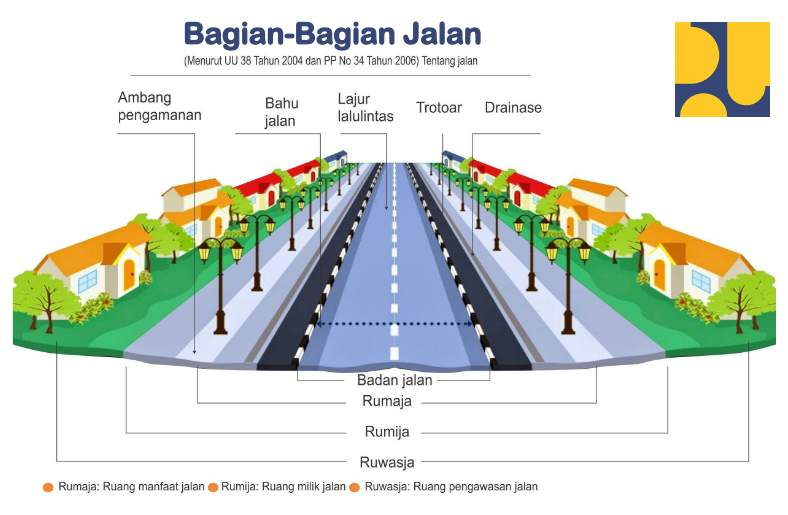
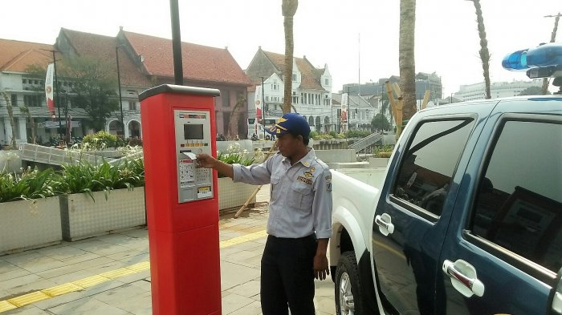

# Parkir Jakarta API

## Daftar Isi

- [Parkir Jakarta API](#parkir-jakarta-api)
  - [Daftar Isi](#daftar-isi)
  - [Cakupan](#cakupan)
    - [Pengukuran Tingkat Pengunaan Jasa Layanan](#pengukuran-tingkat-pengunaan-jasa-layanan)
    - [Pekerjaan Masa Depan (*Future Works*)](#pekerjaan-masa-depan-future-works)
  - [Tingkat Urgensi Kegunaan Service](#tingkat-urgensi-kegunaan-service)
    - [Apakah Web Service ini Bermanfaat?](#apakah-web-service-ini-bermanfaat)
    - [Use Case Web Serivce](#use-case-web-serivce)
  - [Tingkat Kesulitan Pembuatan Service](#tingkat-kesulitan-pembuatan-service)
  - [Keunikan Service](#keunikan-service)
  - [Keuntungan dari Web Service](#keuntungan-dari-web-service)
  - [Daftar Service](#daftar-service)
    - [Lokasi Parkir](#lokasi-parkir)
    - [Tarif Layanan Parkir](#tarif-layanan-parkir)
  - [Contoh Pemanggilan Service](#contoh-pemanggilan-service)

Parkir Jakarta API adalah *web service* yang menyediakan layanan perhitungan tarif layanan parkir di Jakarta berdasarakan parameter tertentu dan lokasi parkir sesuai dengan yang tertulis pada [Peraturan Gubernur Provinsi Daerah Khusus Ibukota Jakarta Nomor 31 Tahun 2017](./misc/Peraturan%20Gubernur%20Provinsi%20Daerah%20Khusus%20Ibukota%20Jakarta%20Nomor%2031%20Tahun%202017.pdf).

> Note: API ini tidak memperhitungkan kebijakan tarif disinsentif yang mengacu pada [Peraturan Gubernur DKI Jakarta Nomor 66 Tahun 2020 tentang Uji Emisi Gas Buang Kendaraan Bermotor](./misc/Peraturan%20Gubernur%20DKI%20Jakarta%20Nomor%2066%20Tahun%202020%20tentang%20Uji%20Emisi%20Gas%20Buang%20Kendaraan%20Bermotor.pdf).

## Cakupan

Sebagaimana yang tertuang dalam pasal 3, 4, dan 5 pada [Peraturan Gubernur Provinsi Daerah Khusus Ibukota Jakarta Nomor 31 Tahun 2017](./docs/Peraturan%20Gubernur%20Provinsi%20Daerah%20Khusus%20Ibukota%20Jakarta%20Nomor%2031%20Tahun%202017.pdf), tarif layanan parkir diperuntukkan untuk jasa layanan parkir sebagai berikut.

1. **Tarif layanan parkir di ruang milik jalan (rumija)**: jasa pemakaian fasilitas parkir di ruang milik jalan yang dikelola Pemerintah Daerah Jakarta.

   - Ilustrasi Ruang Milik Jalan (rumija)

      
      Sumber gambar: <https://pupr.ngawikab.go.id/pengertian-rumaja-rumija-dan-ruwasja/>

2. **Tarif layanan pemakaian lingkungan/pelataran/gedung Parkir**: jasa pemakaian fasilitas parkir di lingkungan parkir, pelataran parkir, dan gedung parkir yang dikelola Pemerintah Daerah Jakarta.

   - Gambar Lingkungan Parkir
      
      Summber Gambar: <https://news.detik.com/berita/d-6813056/janji-pengelola-cegah-bayar-parkir-2-kali-blok-m-square-terulang-lagi>

   - Gambar Pelataran Parkir

      
      Sumber Gambar: <https://www.google.com/maps/contrib/111681948935392072475>

   - Gambar Gedung Parkir

      
      Sumber Gambar: <https://id.wikipedia.org/wiki/Gedung_parkir>

3. **Tarif layanan penitipan kendaraan dan park and ride**: jasa penitipan Kendaraan dan fasilitas park and ride yang dikelola Pemerintah Daerah Jakarta.

   - Park and Ride

      Park and ride adalah fasilitas parkir di luar ruang milik jalan yang Terintegrasi dengan moda angkutan massal, seperti di stasiun, terminal dalam kota dan terminal luar kota, serta pusat kegiatan lainnya.
      
      Sumber Gambar: <https://news.republika.co.id/berita/oug5kl384/pemprov-terus-tambah-kawasan-park-and-ride>

4. **Tarif layanan parkir vallet**: jasa parkir vallet pada fasilitas parkir yang dikelola Pemerintah Daerah Jakarta.

   - Parkir vallet

      Parkir vallet adalah jasa untuk memarkirkan kendaraan yang dilakukan oleh seorang petugas.

      
      Sumber Gambar: <https://www.nusabali.com/berita/14821/level-21-mall-beri-fasilitas-valet-parkir-gratis>

5. **Tarif layanan dengan alat ukur terminal parkir elektronik (TPE)**: jasa parkir pada lokasi parkir dengan alat ukur yang dikelola Pemerintah Daerah Jakarta.

   - Gambar Parkir dengan alat ukur terminal parkir elektronik (TPE)

      
      Sumber Gambar: <https://jakarta.tribunnews.com/2020/02/09/mesin-parkir-elektronik-peninggalan-ahok-makin-terabaikan-dishub-dki-masih-berfungsi-tapi>

### Pengukuran Tingkat Pengunaan Jasa Layanan

| Nama Jasa Layanan Parkir              | Parameter Pengukuran                                                                                                                                                              |
| ------------------------------------- | --------------------------------------------------------------------------------------------------------------------------------------------------------------------------------- |
| ruang milik jalan                     | <ul><li>golongan jalan</li><li>jenis kendaraan</li><li>jangka waktu parkir</li></ul>                                                                                              |
| lingkungan/pelataran/gedung parkir    | <ul> <li>tarif atas pemakaian jam pertama (tarif dasar)</li> <li>ditambah dengan tarif jam berikutnya atas pemakaian satuan ruang parkir (SRP)</li> <li>jenis kendaraan</li></ul> |
| penitipan kendaraan dan park and ride | <ul><li>jenis kendaraan</li><li>jangka waktu parkir</li></ul>                                                                                                                     |
| vallet                                | <ul><li>penggunaan jasa layanan untuk 1 kali parkir</li></ul>                                                                                                                     |
| terminal parkir elektronik (TPE)      | <ul><li>penggunaan jumlah satuan ruang parkir (SRP) yang digunakan dikalikan jam penggunaan dalam 1 hari</li></ul>                                                                |

### Pekerjaan Masa Depan (*Future Works*)

Parkir Jakarta API diharapkan dapat mencakup seluruh area lokasi parkir yang ada di Jakarta termasuk namun tidak terbatas pada mall/pusat perbelanjaan di Jakarta dan area layanan parkir yang dikelola oleh individu atau badan usaha selain Pemerintah Daerah Jakarta. Namun, karena keterbatasan data dan sumber daya untuk mencari dan menyimpan semua informasi mengenai tarif layanan parkir yang bervariasi, tergantung pada individu atau badan usaha yang mengelola area parkir tersebut, pembuat saat ini membatasi layanan API ke area jasa layanan parkir yang dikelola oleh Pemerintah Daerah Jakarta saja. Hal ini dikarenakan aturan terkait dengan tarif layanan parkir yang dikelola oleh Pemerintah Daerah Jakarta, dengan jelas, tertuang pada [Peraturan Gubernur Provinsi Daerah Khusus Ibukota Jakarta Nomor 31 Tahun 2017](./misc/Peraturan%20Gubernur%20Provinsi%20Daerah%20Khusus%20Ibukota%20Jakarta%20Nomor%2031%20Tahun%202017.pdf).

Setelah daerah Jakarta berhasil dicakup oleh *web serivce* dalam pekerjaan masa depan, kita bisa melakukan ekspansi dengan mencakup seluruh area lokasi parkir di Indonesia sedemikian hingga dapat membuat *web service* yang terfokus pada perhitungan tarif layanan parkir di seluruh area lokasi parkir di Indonesia. Dengan demikian, Parkir API menyediakan solusi untuk mengintegrasikan tarif layanan parkir ke sistem pembayaran aplikasi pihak ketiga dengan cepat, mudah, kredibel, dan akurat.

## Tingkat Urgensi Kegunaan Service

### Apakah Web Service ini Bermanfaat?

Ya! Bagaimana cara Anda mengetahui dan mempersiapkan uang tunai untuk membayar tarif layanan parkir di area tertentu di Jakarta? Mungkin, Anda dapat berpendapat bahwa Anda cukup menyiapkan uang lebih untuk mempersiapkan pembayaran parkir di area tertentu di Jakarta ketika Anda menggunakan jasa layanan parkir. Itu tidak sepenuhnya salah.

Namun, bagaimana bila tarif layanan parkir ingin diintegrasikan ke sebuah aplikasi yang mengikutsertakan tarif layanan parkir ke dalam sistem pembayaran pada aplikasi tersebut? Mungkin, untuk ini pun, Anda dapat berpendapat bahwa Anda cukup menetapkan tarif layanan parkir pada tarif tertentu yang bersifat tetap (misalnya, Rp 10.000,00 digunakan sebagai tarif layanan parkir yang bersifat tetap) pada aplikasi Anda. Namun, bagaimana bila pengguna aplikasi Anda mengetahui bahwa tarif layanan parkir yang bersifat tetap tersebut tidak sesuai dengan tarif layanan parkir yang sebenarnya? Pengguna aplikasi Anda akan merasa terbohongi (pengguna bisa merasa bahwa aplikasi sengaja meningkatkan tarif layanan parkir untuk mendapatkan keuntungan lebih) dan merasakan isu kepercayaan terhadap aplikasi. Akibatnya, pengguna aplikasi Anda dapat mengurangi penggunaan karena isu kepercayaan tersebut, bahkan meninggalkan aplikasi kalian dan berpaling ke kompetitor.

Untuk mengatasi hal yang telah dipaparkan di atas, Parkir Jakarta API dibuat untuk membantu integrasi tarif layanan parkir ke aplikasi yang Anda kembangkan. Melalui Parkir Jakarta API, Anda dapat mengintegrasikan tarif layanan parkir ke sistem pembayaran aplikasi Anda dengan cepat, mudah, kredibel, dan akurat. Dengan demikian, pengguna aplikasi Anda akan dipermudah dalam urusan pembayaran dan melibatkan tarif layanan parkir dan pengguna Anda akan mengalami pengalaman terbaik dalam menggunakan aplikasi Anda.

> **Note**: Akurasi tarif layanan parkir diperlukan karena tarif layanan parkir dan mekanisme perhitungan tarif parkir dapat terus berubah-ubah sesuai dengan kebijakan yang dibuat oleh pemerintah daerah, individu, dan badan usaha yang mengelola area parkir tersebut. Dengan demikian, penetapan tarif layang parkir yang bersifat tetap (misalnya Rp 2.000,00 atau Rp 3.000,00 untuk setiap area parkir atau untuk setiap kasus) akan sulit diterapkan karena tidak akurat.

### Use Case Web Serivce

Ada berbagai use case yang dapat memanfaatkan *web service* ini untuk menunjang proses bisnis yang ada pada berbagai aplikasi tersebut. Berbagai use case tersebut adalah sebagai berikut.

   > **Note**: Benefit di bawah akan terasa lebih lagi bila fitur pada bagian [Pekerjaan Masa Depan (*Future Works*)](#pekerjaan-masa-depan-future-works) telah berhasil diimplementasikan.

1. Layanan aplikasi pesan antar makanan (*food delivery app*), seperti Go-Food dan Grab-Food.

   Ketika pengguna menggunakan jasa Go-Food atau Grab-Food untuk memesan makanan, ada kalanya *driver* harus memarkirkan kendaraannya di area lokasi parkir tertentu, contohnya adalah ketika pengguna memesan makanan di mall tertentu yang menyebabkan *driver* harus memarkirkan kendaraan dan masuk ke mall tersebut. Area lokasi parkir yang dikelola oleh Pemerintah Daerah Jakarta, individu, atau badan usaha tersebut akan memiliki tarif layanan parkir.<br>
   Nah, bagaimana tarif parkir tersebut dibayarkan oleh *driver* yang bersangkutan? Untuk saat ini, beberapa *driver* akan langsung mengomunikasikan ke pengguna bahwa ada tambahan biaya parkir yang harus dibayarkan atau *driver* sendiri yang langsung menanggung biaya tersebut. Di sisi lain, aplikasi pun sudah membantu *driver* dengan menspesifikkan secara langsung tarif layanan parkir (*parking fee*) yang bersifat tetap (misalnya Rp 2.000,00 atau Rp 3.000,00) pada area tertentu yang harus dibayarkan oleh pengguna aplikasi sehingga tidak membebankan tarif layanan parkir ke *driver*. Namun, tarif layanan parkir ini tidak menyeluruh di seluruh wilayah Jakarta, maupun Indonesia. Selain itu, penetapan tarif layanan parkir tidak menyesuaikan dengan seberapa lama driver tersebut memarkirkan kendaraan di area lokasi parkir tertentu (kadang kala *driver* harus menunggu lebih lama karena ada waktu tunggu pada restoran di mall tertentu atau ketika driver menangani lebih dari satu pesan sekaligus, seperti pada fitur *Grab-Food multiple delivery*). Dengan demikian, Parkir Jakarta API dapat digunakan untuk membantu aplikasi lain yang ingin mengintegrasikan tarif layanan parkir ke sistem pembayaran aplikasi lain dengan cepat, mudah, kredibel, dan akurat.

2. Layanan aplikasi perjalanan (*traveling app*), seperti Traveloka.

   Pada saat pengguna, seperti *solo traveller* ingin merencanakan perjalanan dengan uang yang terbatas, mereka harus bisa merinci apa saja pengeluaran yang akan terjadi selama perjalanan tersebut berlangsung. Apabila aplikasi perjalanan juga mengintegrasikan tarif layanan parkir ke sistem pembayaran aplikasi (misalnya dalam pembelian paket perjalanan tertentu), pengguna tersebut (khususnya *solo traveller* yang berpergian dengan uang yang terbatas) pasti akan sangat terbantu untuk mengetahui, merencanakan, dan mempersiapkan uang yang diperlukan untuk semua aktivitas yang terjadi selama perjalanan berlangsung.

   > **Note**: Hal ini untuk mengakomodasikan parkir di destinasi wisata yang biasanya memiliki tarif layanan parkir yang lebih mahal dibandingkan dengan tarif layanan parkir pada area lokasi parkir yang umum di perkotaan.

3. Layanan aplikasi kirim barang instan, seperti Go-send.

   Ketika pengguna menggunakan jasa Go-send untuk mengirim barang, ada kalanya *driver* harus memarkirkan kendaraannya di area lokasi parkir tertentu ketika penerima barang yang bersangkutan memiliki tempat tinggal di apartemen (*driver* mengantarkan di area tertentu di apartemen). Siapa yang perlu membayar biaya parkir tersebut? Apakah pengirim, penerima, atau *driver* yang bersangkutan? Secara sederhana, bila aplikasi mengintegrasikan tarif layanan parkir ke sistem pembayaran aplikasi, pembayaran biaya parkir akan dibayarkan oleh pengguna Go-send, yaitu pengirim barang. Dengan demikian, Parkir Jakarta API dapat digunakan untuk membantu aplikasi lain yang ingin mengintegrasikan tarif layanan parkir ke sistem pembayaran aplikasi lain dengan cepat, mudah, kredibel, dan akurat.

4. Layanan aplikasi belanja barang pada hari yang sama, seperti Go-Mart, dan Go-Shop.

   Ketika pengguna menggunakan jasa Go-Mart atau Go-Shop untuk membeli barang, ada kalanya *driver* harus memarkirkan kendaraannya di area lokasi parkir tertentu dan kemudian berbelanja di toko tersebut (contohnya adalah ketika *driver* harus masuk ke mall untuk membeli barang di toko tertentu yang mengharuskan *driver* untuk memarkirkan kendaraannya). Namun, sebisa mungkin, *driver* tidak dibebani dengan tarif layanan parkir tersebut. Dengan demikian, Parkir Jakarta API dapat digunakan untuk membantu aplikasi lain yang ingin mengintegrasikan tarif layanan parkir ke sistem pembayaran aplikasi lain dengan cepat, mudah, kredibel, dan akurat.

5. Perusahaan yang menerapkan sistem pengembalian uang (*reimbursement*) terhadap tarif layanan parkir.

   Ada berbagai perusahaan yang menerapakan sistem pengembalian uang terhadap tarif layanan parkir ketika ada perjalanan tertentu, sepreti perjalanan dinas, perjalanan wisata, dan perjalanan pengantaran barang ke klien. Dengan memanfaatkan Parkir Jakarta API, perusahaan dapat memastikan berapa tarif layanan parkir yang harus disiapkan ketika ada perjalanan tertentu. Selain itu, jika perusahaan tetap menerapkan sistem pengembalian uang (*reimbursement*), perusahaan dapat menggunakan Parkir Jakarta API untuk memvalidasi tarif layanan parkir tersebut.

6. Aplikasi Parkir Online.

   Pengembang aplikasi parkir *online* sebagai solusi untuk mendapatkan tempat parkir bagi kendaraan pada waktu tertentu di lokasi tertentu secara *online* dapat menggunakan Parkir Jakarta API untuk menentukan tarif layanan parkir yang harus dibayarkan oleh pengguna atas jasa layanan parkir online tersebut.

7. Individu yang ingin mengecek tarif layanan parkir pada suatu lokasi parkir tertentu.

   Bagaimana cara individu mengecek tarif layanan parkir pada suatu lokasi parkir tertentu saat ini? Mungkin individu tersebut akan mencari lewat google dengan *query* berupa "[biaya parkir di kelapa gading](https://www.google.com/search?q=biaya+parkir+di+kelapa+gading)". Namun, seberapa relevan hasil pencarian tersebut? Dengan Parkir Jakarta API, individu tersebut dapat dengan mudah, cepat, dan akurat mengecek tarif layanan parkir dan mekanisme tarif layanan parkir pada suatu lokasi parkir tertentu.

## Tingkat Kesulitan Pembuatan Service

Tingkat kesulitan pembuatan service menegah. Hal ini dikarenakan *web service* berfokus pada penyediaan **informasi** mengenai **tarif layanan parkir** dan **perhitungan tarif layanan parkir**. Hal ini berarti *web service* harus **mencari, mendapatkan, dan menyediakan** data mengenai tarif layanan parkir yang **bervariasi** dan perhitungan tarif layanan parkir yang **bervariasi**. Selain itu, *web service* juga harus melakukan standardisasi mengenai format informasi yang disediakan karena banyaknya informasi mengenai tarif layanan parkir yang bervariasi dan mekanisme perhitungan tarif layanan parkir yang **bervariasi** juga.

> **Note**: Perhatikan bahwa Parkir Jakarta API berfokus pada penyediaan **informasi** mengenai **tarif layanan parkir** dan **perhitungan tarif layanan parkir**, seperti halnya HolidayAPI dan Currency Conversion API, dibandingkan dengan API yang menyediakan proses dari algoritma kompleks untuk menghasilkan output tertentu, seperti ChatGPT API. Selain itu, API ini diperlukan karena tarif layanan parkir dan mekanisme perhitungan tarif parkir yang dapat terus berubah-ubah sesuai dengan kebijakan yang dibuat oleh pemerintah daerah, individu, dan badan usaha yang mengelola area parkir tersebut.

## Keunikan Service

*Web service* ini unik karena belum ada API yang menyediakan informasi terkait dengan tarif layanan parkir dan mekanisme tarif layanan parkir yang dapat digunakan oleh aplikasi pihak ketiga untuk mengintegrasikan tarif layanan parkir ke sistem pembayaran aplikasi pihak ketiga dengan cepat, mudah, kredibel, dan akurat. Selain itu, informasi tarif layanan parkir dan mekanisme tarif layanan parkir ini juga dapat digunakan oleh pengguna individu untuk mengetahui, merencanakan, dan mempersiapkan hal-hal yang terkait dengan tarif layanan parkir.

## Keuntungan dari Web Service

Ketika *web service* ini dapat menyediakan informasi mengenai tarif layanan parkir dan mekanisme tarif layanan parkir yang cepat, mudah, kredibel, dan akurat, akan banyak aplikasi pihak ketiga dan individu yang akan menggunakannya untuk kebutuhan ataupun proses bisnis yang terkait dengan tarif layanan parkir. Untuk  memelihara informasi agar tetap relevan, kredibel, dan akurat, *web service* ini harus memperoleh keuntungan. Keuntungan dari *web service* ini dapat diperoleh melalui mekanisme *pay-per-use* berdasarkan jumlah pemanggilan dan jumlah data yang dikirim dalam byte untuk aplikasi pihak ketiga yang ingin terintegrasi dengan Parkir Jakarta API. Selain itu, akan diterapkan pula limitasi pemanggilan bagi individu yang ingin mencoba API ini dan pembelian jumlah pemanggilan tambahan API.

## Daftar Service

*Web service* ini menyediakan API sebagai berikut.

### Lokasi Parkir

1. Mendapatkan informasi mengenai lokasi parkir yang dikelola oleh Pemerintah Daerah Jakarta

   Method: GET

   >```text
   >/api/v1/lokasi
   >```

2. Mendapatkan detail lokasi parkir

   Method: GET

   >```text
   >/api/v1/lokasi/:id
   >```

3. Mencari lokasi parkir berdasarkan parameter tertentu

   Method: GET

   >```text
   >/api/v1/lokasi
   >```

   Query Params

   | Param                  | value                       |
   | ---------------------- | --------------------------- |
   | search                 | <nama_lokasi>               |
   | jenis                  | <jenis_jasa_layanan_parkir> |
   | kapasitas_mobil        | <jumlah_kapasistas>         |
   | kapasitas_motor        | <jumlah_kapasistas>         |
   | kapasitas_bus_truk     | <jumlah_kapasistas>         |
   | min_luas_m2            | <luas_parkiran>             |
   | max_luas_m2            | <luas_parkiran>             |
   | max_kapasitas_mobil    | <jumlah_kapasistas>         |
   | min_kapasitas_mobil    | <jumlah_kapasistas>         |
   | max_kapasitas_motor    | <jumlah_kapasistas>         |
   | min_kapasitas_motor    | <jumlah_kapasistas>         |
   | max_kapasitas_bus_truk | <jumlah_kapasistas>         |
   | min_kapasitas_bus_truk | <jumlah_kapasistas>         |

### Tarif Layanan Parkir

1. Mendapatkan informasi mengenai jenis jasa layanan parkir yang dikelola oleh Pemerintah Daerah Jakarta

   Method: GET

   >```text
   >/api/v1/tarif/
   >```

2. Mendapatkan detail untuk masing-masing jenis jasa layanan parkir

   - jasa layanan parkir pada ruang milik jalan (rumija)

      Method: GET

      >```text
      >/api/v1/mekanisme-rumija/
      >```

   - jasa layanan parkir pada lingkungan parkir

      Method: GET

      >```text
      >/api/v1/mekanisme-lingkungan/
      >```

   - jasa layanan parkir pada pelataran parkir

      Method: GET

      >```text
      >/api/v1/mekanisme-pelataran/
      >```

   - jasa layanan parkir pada gedung parkir

      Method: GET

      >```text
      >/api/v1/mekanisme-gedung/
      >```

   - jasa layanan parkir pada lokasi penitipan kendaraan

      Method: GET

      >```text
      >/api/v1/mekanisme-penitipan/
      >```

   - jasa layanan parkir pada lokasi park-and-ride

      Method: GET

      >```text
      >/api/v1/mekanisme-park-and-ride/
      >```

   - jasa layanan parkir pada lokasi park-and-ride

      Method: GET

      >```text
      >/api/v1/mekanisme-vallet/
      >```

   - jasa layanan parkir pada lokasi dengan alat ukur terminal parkir elektronik (TPE)

      Method: GET

      >```text
      >/api/v1/mekanisme-tpe/
      >```

## Contoh Pemanggilan Service

Contoh pemanggilan *web service* terdapat pada file [`postman.md`](./misc/postman.md) atau folder [`screenshot`](./screenshot/).

:link: [postman.md](./misc/postman.md)
:link: [/screenshot](./screenshot/)
